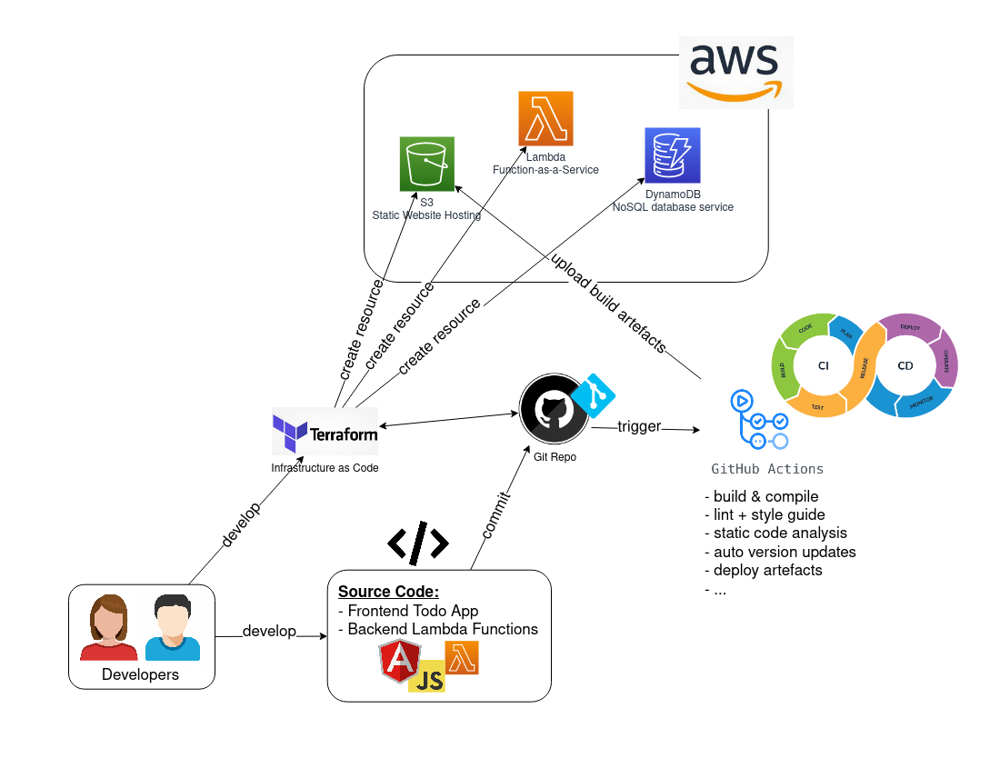

# Repository Description

This repository contains:

- Lambda functions source in `lambda/functions/`:
    - deleteTodo
    - getTodos
    - updateTodo
- Terraform plans:
    - `terraform/dynamodb/`, which creates the DynamoDB Table.
    - `terraform/lambda/`, which creates the functions.
    - `terraform/s3/`, which creates an S3 bucket for static website hosting.

The source of the Angular App, which gets deployed to the S3 bucket,
is hosted in another Git repository 
[https://github.com/thomasstxyz/FHB-MCCE-2022-Todo-Frontend-2](https://github.com/thomasstxyz/FHB-MCCE-2022-Todo-Frontend-2)

# Provisioning Process & Automation Flow

Initially the AWS resources [S3 bucket](https://docs.aws.amazon.com/s3/index.html),
[Lambda functions](https://aws.amazon.com/lambda/) 
and [DynamoDB table](https://aws.amazon.com/dynamodb/)
are provisioned via Terraform plans, which are stored in a Git Repository.

[Terraform Cloud](https://learn.hashicorp.com/tutorials/terraform/github-actions)
can be used for further automation.

The AWS credentials are stored as [Secrets](https://docs.github.com/en/actions/security-guides/encrypted-secrets) in the GitHub Repository
of the [AngularJS Frontend App](https://github.com/thomasstxyz/FHB-MCCE-2022-Todo-Frontend-2).

Git commits trigger a CI pipeline, which uploads the 
build artefacts to the S3 bucket as a last step.
